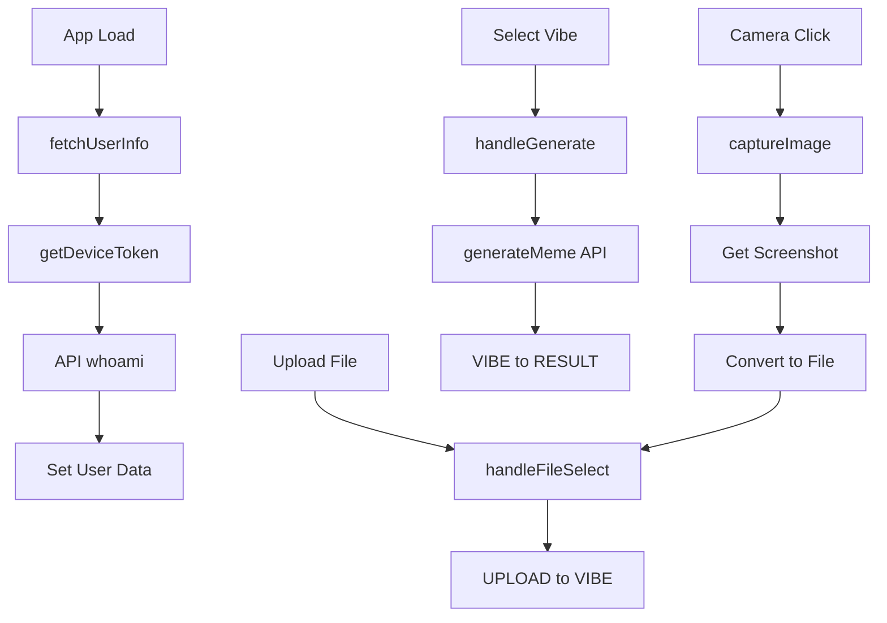

# Meme Aunty Frontend - Code Architecture

## Meme Aunty
Your AI-Powered Indian Aunty Meme Generator 🚀

Meme Aunty is a full-stack meme generation platform that creates hilarious, culturally authentic Indian aunty memes using Google Gemini AI — like having your favorite aunty roast you, but in meme format.

## 🔥 Features

**Smart Device Fingerprinting**
- Browser-based identification using screen, timezone, user agent, and language
- Rate limiting that works across incognito/multiple browsers from same device
- Persistent user identity with fun codenames (e.g., "clever-mongoose")

**AI-Powered Meme Generation**
- Google Gemini AI integration for contextual, image-aware captions
- Three distinct vibes: Wholesome, Spicy, and Savage aunty personalities
- Upload your own images or capture photos directly with webcam

**Modern UI/UX**
- Responsive, mobile-first design with professional camera overlay
- Three-step workflow: Upload → Vibe Selection → Result
- Real-time credit tracking and usage feedback
- Seamless file handling with drag-and-drop support

**Rate Limiting & Fair Usage**
- 10 memes per device per day to prevent abuse
- Smart fingerprinting prevents rate limit bypassing
- Visual credit counter and quota management

## 🛠️ Tech Stack

| Category | Technology |
|----------|------------|
| Frontend | React 18, Vite, JSX |
| Styling | Tailwind CSS, Custom Components |
| State | Custom Hooks Pattern (useMemeGenerator) |
| API | Axios, FormData handling |
| Security | Device Fingerprinting, localStorage persistence |
| Camera | react-webcam |
| File Handling | File API, Image validation |

## 📁 Project Structure
```
Client/
├── src/
│   ├── hooks/                  → Business logic (useMemeGenerator)
│   ├── services/               → API communication layer
│   ├── utils/                  → Device fingerprinting utilities
│   ├── components/
│   │   ├── steps/             → Workflow components (Upload, Vibe, Result)
│   │   └── ui/                → Reusable UI components
│   ├── constants/             → App configuration and state definitions
│   └── assets/                → Static images and icons
├── public/                    → Aunty logos and static assets
└── docs/                      → API and component documentation
```

 
## 🔄 Application Flow



## 📂 Module Functions

### **hooks/useMemeGenerator.js** - Core Business Logic
- `fetchUserInfo()` - Calls `/whoami/` endpoint with device token to get username and remaining credits
- `handleFileSelect()` - Validates file size/type, creates preview URL, transitions from UPLOAD to VIBE state
- `handleGenerate()` - Creates FormData with file + vibe + device token, calls backend API, handles loading states
- `captureImage()` - Uses webcam ref to take screenshot, converts canvas to blob, creates File object
- `handleMakeAnother()` - Resets all state (file, vibe, result) and returns to UPLOAD state for new meme

### **utils/deviceFingerprint.js** - Browser Fingerprinting
- `generateBasicFingerprint()` - Hashes screen resolution + timezone + userAgent + language for device ID
- `getDeviceToken()` - Combines browser fingerprint with localStorage UUID to create persistent identifier
- Creates format: `"abc123def-uuid-from-localstorage"` for rate limiting across browser sessions

### **services/memeService.js** - API Communication
- `generateMeme()` - POST to `/generate-meme/` with FormData containing image, vibe, device_token
- `fetchUserInfo()` - POST to `/whoami/` with device token to get user identity and quota status
- Uses axios with proper error handling and response data extraction

### **components/steps/** - UI State Components
- `UploadStep.jsx` - File drag-drop zone, webcam modal with live preview, file validation UI
- `VibeStep.jsx` - Three vibe buttons (wholesome/spicy/savage), generate button with credit check
- `ResultStep.jsx` - Displays generated meme image, caption text, share buttons, "make another" action

### **constants/app.js** - State Management Config
- `STATES` - Enum-like object defining workflow: `{UPLOAD: 'upload', VIBE: 'vibe', RESULT: 'result', NO_CREDITS: 'no_credits'}`
- `STATE_CONFIGS` - Maps each state to UI text, button labels, progress indicators
- `APP_CONFIG` - File size limits (10MB), allowed types (.jpg, .png, .gif), API endpoints

## 🎯 State Flow
The application follows a simple, linear state progression:
```
UPLOAD → VIBE → RESULT → UPLOAD (loop)
   ↓
NO_CREDITS (if quota is exceeded at any point)
```


## 🚀 Setup

```bash
# Install dependencies
npm install

# Run the development server
npm run dev
```

## 🔧 Environment
Create a `.env` file in the `Client` directory:
```env
VITE_API_URL=http://localhost:8000
```